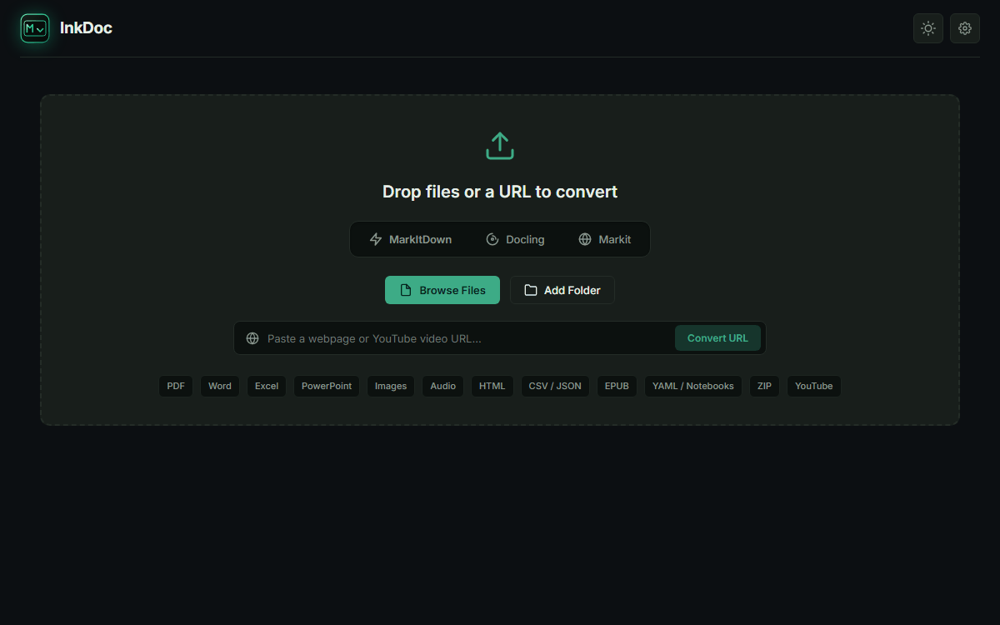
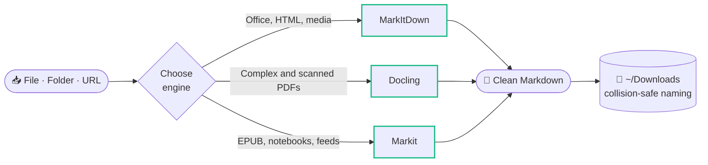

<a id="readme-top"></a>

<div align="center">


# InkDoc

### High-Fidelity Document Workbench & Multi-Engine Conversion System

A unified desktop workbench and local REST API that bridges **Microsoft MarkItDown**, **IBM Docling**, and **Shift Labs Markit** into one zero-friction Markdown pipeline — with collision-safe auto-saving.

<br />

<!-- Tip: replace the static CI badge with the live one once you know your workflow file name:
     https://github.com/AbdoslamB/inkdoc/actions/workflows/<workflow-file>.yml/badge.svg -->
<p align="center">
  <a href="https://github.com/AbdoslamB/inkdoc/releases"></a>
  <a href="LICENSE"></a>
  <a href="https://www.python.org/downloads/"></a>
  <a href="#download"></a>
  <a href="https://github.com/AbdoslamB/inkdoc/actions"></a>
  <a href="https://github.com/astral-sh/ruff"></a>
</p>

<p align="center">
  <a href="https://abdoslamb.github.io/InkDoc/"><b>Website</b></a> &nbsp;•&nbsp;
  <a href="#download"><b>Download</b></a> &nbsp;•&nbsp;
  <a href="#quickstart"><b>Quickstart</b></a> &nbsp;•&nbsp;
  <a href="#engines"><b>Engines</b></a> &nbsp;•&nbsp;
  <a href="API.md"><b>REST API</b></a> &nbsp;•&nbsp;
  <a href="CONTRIBUTING.md"><b>Contributing</b></a>
</p>

<br />



<sub>Drop a file, directory, or URL → conversion starts instantly → clean Markdown is auto-saved to <code>~/Downloads</code> with collision-safe naming.</sub>

</div>

<br />

## <a id="download"></a>⬇️ Download

Ready-to-run desktop packages with every dependency and runtime bundled — **no Python installation required.**

<p align="center">
  <a href="https://github.com/AbdoslamB/inkdoc/releases/latest/download/inkdoc-setup.exe"></a>
  <a href="https://github.com/AbdoslamB/inkdoc/releases/latest/download/inkdoc.exe"></a>
  <a href="https://github.com/AbdoslamB/inkdoc/releases/latest/download/inkdoc-macos.zip"></a>
  <a href="https://github.com/AbdoslamB/inkdoc/releases/latest/download/inkdoc-linux.zip"></a>
</p>

<details>
<summary><b>Release matrix &amp; system requirements</b></summary>

<br />

| Operating system | Package | Architecture | Requirements | Download |
| :--- | :--- | :--- | :--- | :--- |
| **Windows 10 / 11** | Setup wizard | x86_64 | Windows 10 build 19041+ (WebView2 built-in) | [`inkdoc-setup.exe`](https://github.com/AbdoslamB/inkdoc/releases/latest/download/inkdoc-setup.exe) |
| **Windows 10 / 11** | Portable executable | x86_64 | Standalone single-file executable | [`inkdoc.exe`](https://github.com/AbdoslamB/inkdoc/releases/latest/download/inkdoc.exe) |
| **Windows 10 / 11** | Portable ZIP archive | x86_64 | Portable folder bundle | [`inkdoc-windows.zip`](https://github.com/AbdoslamB/inkdoc/releases/latest/download/inkdoc-windows.zip) |
| **macOS** | Application bundle | Apple Silicon (arm64) | macOS 12 Monterey or newer (Apple Silicon M1/M2/M3/M4) | [`inkdoc-macos.zip`](https://github.com/AbdoslamB/inkdoc/releases/latest/download/inkdoc-macos.zip) |
| **Linux** | Portable bundle | x86_64 | Ubuntu 22.04 LTS+ (glibc 2.35+), WebKit2GTK runtime | [`inkdoc-linux.zip`](https://github.com/AbdoslamB/inkdoc/releases/latest/download/inkdoc-linux.zip) |

> [!IMPORTANT]
> **Platform Support Note:** macOS builds are currently native for **Apple Silicon (arm64)** only. Intel Macs (x86_64) are not supported. Windows builds are compiled for **x86_64** (ARM64 Windows devices run x86_64 emulation). Linux builds are compiled and verified on **Ubuntu 22.04 LTS (glibc 2.35+)**.

</details>

> [!NOTE]
> **Windows SmartScreen:** InkDoc's Windows builds aren't code-signed yet, so Windows may show "Windows protected your PC" on first run. Verify your download below, then choose **More info → Run anyway**.

> [!NOTE]
> **macOS First Run (Unsigned Application):** InkDoc macOS builds are currently unsigned. On first launch, macOS Gatekeeper may show a warning ("cannot be opened because the developer cannot be verified"). To open the application:
> - **Finder:** In Finder, **right-click (or Control-click)** `inkdoc.app`, select **Open**, and click **Open** in the confirmation dialog.
> - **Terminal:** Remove the quarantine attribute recursively:
>   ```bash
>   xattr -dr com.apple.quarantine inkdoc.app
>   ```

<details open>
<summary><b>Updates &amp; cryptographic verification</b></summary>

<br />

InkDoc features a security-first update workflow designed to protect users against supply-chain tampering and man-in-the-middle attacks:

- **Offline Ed25519 Signature Verification:** The update manifest (`inkdoc-update-manifest.json`) is cryptographically signed using an air-gapped Ed25519 private key. InkDoc verifies the signature over the exact, unparsed base64 envelope bytes before parsing. Any signature mismatch or payload tampering immediately aborts the update.
- **Strict CDN Allowlist & Per-Hop Redirect Validation:** Manifest and asset transfers are restricted to official HTTPS endpoints: `github.com`, `objects.githubusercontent.com`, and `release-assets.githubusercontent.com`. Every redirect hop is checked to prevent open-redirect attacks.
- **Pre-execution Re-hashing & Disk Checks:** Downloads stream with HTTP Range-resume support and verify 2.5× required disk headroom. Downloaded files are verified against the manifest's SHA-256 digest upon completion and re-hashed immediately prior to execution.
- **Platform-Specific Update Scope:**
  - **Windows Installer (`inkdoc-setup.exe`):** Silent in-app background upgrade (`/VERYSILENT /SUPPRESSMSGBOXES /NORESTART`) followed by clean process termination and relaunch.
  - **Windows Portable, macOS (arm64), Linux (x86_64):** Verified download directly to `~/Downloads` (`.part` streaming followed by atomic rename), with a one-click **Reveal in Folder** option.
- **Manual Rollback Policy:** The Windows installer path executes an in-place upgrade without automatic rollback. If an issue occurs after an update, users can manually roll back at any time by downloading and installing any prior release from the [GitHub Releases](https://github.com/AbdoslamB/inkdoc/releases) archive.
- **macOS Gatekeeper & Quarantine:** InkDoc builds are unsigned. The updater strictly preserves macOS quarantine attributes and does not strip quarantine. If Gatekeeper blocks execution, right-click `inkdoc.app` and choose **Open**, or run:
  ```bash
  xattr -dr com.apple.quarantine /Applications/inkdoc.app
  ```

#### Manual Checksum & Provenance Verification

Compare the SHA-256 checksum of your download against the signed `SHA256SUMS-*.txt` asset:

```powershell
# Windows
Get-FileHash .\inkdoc-setup.exe -Algorithm SHA256
```

```bash
# macOS / Linux
shasum -a 256 inkdoc-macos.zip
```

Verify build provenance attestations generated by GitHub Actions:

```bash
gh attestation verify inkdoc-setup.exe --repo AbdoslamB/inkdoc
```

</details>

<p align="center">
  <sub>Detailed release notes, asset bundles, and SHA-256 checksums are available on the <a href="https://github.com/AbdoslamB/inkdoc/releases">GitHub Releases</a> page.</sub>
</p>

<br />

## <a id="features"></a>✨ Key Features

<table>
  <tr>
    <td width="50%" valign="top">
      
      <br />
      <b>Tri-Engine Conversion Pipeline</b>
      <br />
      Intelligently dispatches between <b>Microsoft MarkItDown</b> (fast everyday documents), <b>IBM Docling</b> (deep layout analysis and TableFormer reconstruction), and <b>Shift Labs Markit</b> (broad formats like EPUB and Jupyter Notebooks).
    </td>
    <td width="50%" valign="top">
      
      <br />
      <b>Single Source of Truth Interface</b>
      <br />
      The native desktop executable (Edge WebView2 on Windows, WebKit on macOS/Linux) and the local web workbench (<code>http://127.0.0.1:13118/InkDoc</code>) run the <b>exact same user interface</b> without code divergence.
    </td>
  </tr>
  <tr>
    <td width="50%" valign="top">
      
      <br />
      <b>Zero-Friction Auto-Save</b>
      <br />
      Documents convert asynchronously and are <b>automatically saved to <code>~/Downloads</code></b> the moment they finish, with collision-safe numbered suffixes (e.g., <code>report (1).md</code>). No manual export required.
    </td>
    <td width="50%" valign="top">
      
      <br />
      <b>Embedded Local REST API</b>
      <br />
      FastAPI backend with streaming multipart uploads, URL conversion, interactive OpenAPI Swagger documentation (<code>/docs</code>), and a headless server mode for programmatic pipelines and CI/CD.
    </td>
  </tr>
</table>

<br />

## <a id="engines"></a>🧩 Tri-Engine Architecture

InkDoc provides three dedicated conversion routes, switchable at any time from the UI pills or via API query parameters.



|  | **MarkItDown** | **Docling** *(Optional Pack)* | **Markit** |
| :--- | :--- | :--- | :--- |
| **Upstream** | [Microsoft](https://github.com/microsoft/markitdown) | [IBM Research](https://github.com/DS4SD/docling) | [Shift Labs](https://github.com/shift-labs-ai/markit) |
| **Distribution** | **Bundled** out of the box | **Optional 1-click in-app pack** (Settings) | **Bundled** out of the box |
| **Primary strengths** | High throughput, official Microsoft parsers, lightweight runtime | Vision models, reading-order graph segmentation, formula parsing | Multi-format versatility, specialized pure-Python extractors |
| **Best for** | Word (`.docx`), Excel (`.xlsx`), PowerPoint (`.pptx`), HTML, CSV, JSON, XML, audio | Academic papers, multi-column articles, dense technical specifications, scanned PDFs | EPUB e-books, Jupyter Notebooks (`.ipynb`), YAML configs, RSS/Atom feeds |
| **Optical & structural recovery** | Native document metadata, EXIF parsing, speech-to-text transcription via ffmpeg | **Deep OCR** (RapidOCR/EasyOCR), **TableFormer** AI table reconstruction, layout parsing | Code cells, inline outputs, e-book chapter boundary stitching |

> [!NOTE]
> **Optional Engine Architecture & Zero Silent Substitution:**
> MarkItDown and Markit are pre-bundled in all InkDoc distributions. IBM Docling is packaged as an optional, on-demand engine pack due to its deep neural weights.
> Pre-built pack platform availability is derived dynamically from manifest keys in [`app/core/manifest.json`](app/core/manifest.json) (`windows-x86_64`, `linux-x86_64`, `macos-arm64`). When running from source, if `docling` is installed in your local Python environment (`pip install docling`), InkDoc dynamically detects it in source mode and enables it immediately without needing a binary pack.
> *(Release Status: Standalone engine pack downloads are verified against manifest checksums and published release tags. Unverified or placeholder hashes are rejected fail-closed to guarantee supply-chain integrity.)*
> InkDoc enforces a **zero silent substitution** contract: if Docling is selected but not installed or encounters an error, the request is never silently routed to another engine unless you explicitly enable the *"Fall back to MarkItDown if Docling fails"* setting.

<br />

## <a id="formats"></a>📄 Supported Document Formats

Each format has a recommended engine, and you can always switch if a document needs a different approach.

|  | Document class | Supported extensions | Recommended engine |
| :---: | :--- | :--- | :--- |
| 📊 | **Office documents** | Microsoft Word (`.docx`), Excel (`.xlsx`), PowerPoint (`.pptx`), CSV, TSV | `MarkItDown` |
| 📕 | **PDFs & scanned docs** | Native PDF, scanned PDF (with OCR), multi-column articles, research papers | `Docling` or `MarkItDown` |
| 💻 | **Developer & data** | Jupyter Notebooks (`.ipynb`), YAML (`.yaml`, `.yml`), JSON, XML | `Markit` |
| 📚 | **Publications & web** | EPUB e-books, web URLs, YouTube links (automatic transcript extraction) | `Markit` or `MarkItDown` |
| 🎙️ | **Audio recordings** | WAV, MP3, M4A (speech-to-text audio transcription via ffmpeg) | `MarkItDown` |
| 🖼️ | **Images & photos** | PNG, JPEG, TIFF, BMP (EXIF metadata & technical attributes) | `MarkItDown` *(or `Docling` for OCR)* |

<br />

## <a id="quickstart"></a>🚀 Quickstart: Running from Source

> [!TIP]
> Just want to use InkDoc? Skip the setup and [grab a pre-built binary](#download). No Python required.

### 1 · Prerequisites

- **Python 3.10+** ([python.org](https://www.python.org/downloads/))
- *(Optional)* **ffmpeg** on your system `PATH`, if you process audio transcription

### 2 · Clone & set up

```bash
git clone https://github.com/AbdoslamB/inkdoc.git
cd inkdoc

# Create and activate a virtual environment
python -m venv .venv

# Windows (PowerShell):
.venv\Scripts\Activate.ps1
# macOS / Linux:
source .venv/bin/activate

# Install dependencies
python -m pip install --upgrade pip
python -m pip install -r requirements.txt
```

### 3 · Launch

```bash
# Native desktop window (Edge WebView2 / WebKit)
python main.py

# Headless REST API server (no GUI window)
python main.py --headless --port 13118

# Platform helper scripts
run.bat       # Windows
./run.sh      # macOS / Linux
```

Once running, open the local web workbench at **`http://127.0.0.1:13118/InkDoc`** (or `/MarkItDown`).

<br />

## <a id="api"></a>🔌 Embedded Local REST API

InkDoc ships with an embedded REST API for automated pipelines, agents, and developer workflows. Complete endpoint schemas and cURL documentation are in **[`API.md`](API.md)**.

| Endpoint | What it does |
| :--- | :--- |
| `POST /convert/file` | Upload a file (multipart). Choose an engine with `?engine=` and auto-save with `?save_to_downloads=true`. |
| `POST /convert/url` | Convert a web page from a JSON body: `{"url": "...", "save_to_downloads": true}`. |
| `GET /docs` | Interactive OpenAPI (Swagger) UI. |

### Convert a local file (cURL)

```bash
# Convert a PDF with Docling and auto-save straight to Downloads
curl -F "file=@annual_report.pdf" \
  "http://localhost:13118/convert/file?engine=docling&save_to_downloads=true"
```

### Convert a web page (Python)

```python
import requests

response = requests.post(
    "http://localhost:13118/convert/url",
    json={"url": "https://en.wikipedia.org/wiki/Markdown", "save_to_downloads": True}
)

data = response.json()
print(f"Saved to: {data.get('saved_to_downloads')}")
print(data["markdown"][:200])
```

The interactive Swagger UI is available at **`http://localhost:13118/docs`** while the server is running.

<br />

## <a id="development"></a>🛠️ Development

<details>
<summary><b>Repository structure</b></summary>

<br />

```text
inkdoc/
├── app/
│   ├── core/                  # Core conversion domain & engine adapters
│   │   ├── converter.py       # MarkItDown orchestrator & collision-safe auto-save
│   │   ├── queue_model.py     # EngineKind enum, QueueItem data definitions
│   │   └── engines/           # IBM Docling & Shift Labs Markit engine adapters
│   ├── server/                # Embedded FastAPI backend
│   │   └── server.py          # REST endpoints (/convert, /health, /extensions)
│   ├── desktop/               # Native desktop runner
│   │   └── runner.py          # pywebview window manager & loopback orchestration
│   └── ui/                    # Shared Web & Desktop user interface
│       ├── index.html         # Application DOM structure & dropzone
│       ├── style.css          # Inkbench Obsidian design system (CSS custom properties)
│       └── app.js             # Reactive client-side logic & marked.js preview
├── tests/                     # Automated integration test suite
├── examples/                  # Developer client scripts & cURL examples
├── docs/                      # GitHub Pages landing page website
├── API.md                     # Dedicated REST API reference manual
├── CONTRIBUTING.md            # Contribution guidelines & security policy
├── main.py                    # Unified entry point (Desktop GUI or --headless)
└── requirements.txt           # Python dependencies
```

</details>

<details>
<summary><b>Automated testing &amp; verification</b></summary>

<br />

```bash
# 1. Byte-compile all sources (verifies syntax across all modules)
python -m compileall -q main.py app tests examples scripts

# 2. Run API integration tests
python tests/test_server.py

# 3. Run optional engine & security integration tests
python tests/test_optional_engine.py

# 4. Run update system & cryptographic verification tests
python tests/test_update_verifier.py
python tests/test_update_manager.py
python tests/test_update_api.py
python tests/test_update_e2e.py

# 5. Verify code style and formatting with Ruff
ruff check .
```

</details>

<br />

## <a id="contributing"></a>🤝 Community & Contributing

Contributions, bug reports, and feature proposals are welcome.

- Review **[`CONTRIBUTING.md`](CONTRIBUTING.md)** for architecture guidelines, pull request protocols, and test requirements.
- Report security vulnerabilities confidentially via the **[Security Policy](CONTRIBUTING.md#6-security-policy)**.

<br />

## <a id="credits"></a>📜 Authors, Credits & License

**Author & lead maintainer:** [Abdoslam Baabbad](https://github.com/AbdoslamB) ([`@AbdoslamB`](https://github.com/AbdoslamB))

InkDoc is built on excellent open-source work:

| Role | Project | Credit | License |
| :--- | :--- | :--- | :--- |
| Core conversion engine | [`markitdown`](https://github.com/microsoft/markitdown) | Microsoft Corporation | MIT |
| AI document analysis | [`docling`](https://github.com/DS4SD/docling) | IBM Research Zurich | MIT |
| Broad-format extractors | [`@shiftlabs/markit`](https://github.com/shift-labs-ai/markit) *(inspiration)* | Shift Labs AI | MIT |
| Prototype foundation | Early open-source concept | Andres Torres | MIT |

This project is licensed under the **[MIT License](LICENSE)**.

> [!NOTE]
> **InkDoc** is an independent open-source project authored and maintained by Abdoslam Baabbad. It is not affiliated with, endorsed by, or sponsored by Microsoft Corporation or IBM Corporation.

<br />

<div align="center">

<sub>If InkDoc saves you time, a ⭐ on GitHub is always appreciated.</sub>

<sub><a href="#readme-top">↑ Back to top</a></sub>

</div>
