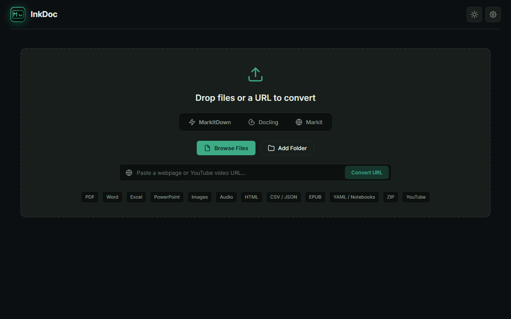
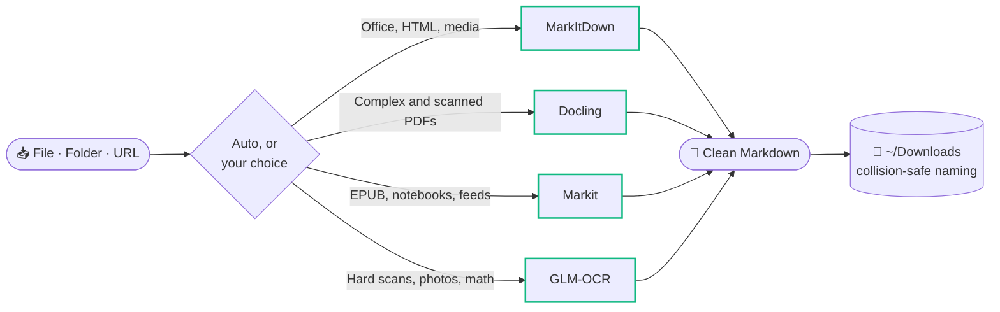

<a id="readme-top"></a>

<div align="center">


# InkDoc

### Turn any document into clean, AI-ready Markdown — most conversions run right on your machine

A unified desktop workbench and local REST API that bridges **Microsoft MarkItDown**, **Docling**, a broad-format **Markit** engine and the **GLM-OCR** model into one zero-friction Markdown pipeline — with collision-safe auto-saving.

<br />

<p align="center">
  <a href="https://github.com/AbdoslamB/inkdoc/releases"></a>
  <a href="LICENSE"></a>
  <a href="https://www.python.org/downloads/"></a>
  <a href="#download"></a>
  <a href="https://github.com/AbdoslamB/InkDoc/actions/workflows/ci.yml?query=branch%3Amain"></a>
  <a href="https://github.com/astral-sh/ruff"></a>
  
</p>

<p align="center">
  <a href="https://abdoslamb.github.io/InkDoc/"><b>Website</b></a> &nbsp;•&nbsp;
  <a href="#download"><b>Download</b></a> &nbsp;•&nbsp;
  <a href="#quickstart"><b>Quickstart</b></a> &nbsp;•&nbsp;
  <a href="#engines"><b>Engines</b></a> &nbsp;•&nbsp;
  <a href="API.md"><b>REST API</b></a> &nbsp;•&nbsp;
  <a href="CONTRIBUTING.md"><b>Contributing</b></a>
</p>

<br />



<sub>Drop a file, directory, or URL → conversion starts instantly → clean Markdown is auto-saved to <code>~/Downloads</code> with collision-safe naming.</sub>

</div>

<br />

## <a id="download"></a>⬇️ Download

Ready-to-run desktop packages with every dependency and runtime bundled — **no Python installation required.**

<p align="center">
  <a href="https://github.com/AbdoslamB/inkdoc/releases/latest/download/inkdoc-setup.exe"></a>
  <a href="https://github.com/AbdoslamB/inkdoc/releases/latest/download/inkdoc.exe"></a>
  <a href="https://github.com/AbdoslamB/inkdoc/releases/latest/download/inkdoc-macos.zip"></a>
  <a href="https://github.com/AbdoslamB/inkdoc/releases/latest/download/inkdoc-linux.zip"></a>
</p>

<details>
<summary><b>Release matrix &amp; system requirements</b></summary>

<br />

| Operating system | Package | Architecture | Requirements | Download |
| :--- | :--- | :--- | :--- | :--- |
| **Windows 10 / 11** | Setup wizard | x86_64 | Windows 10 build 19041+ (WebView2 built-in) | [`inkdoc-setup.exe`](https://github.com/AbdoslamB/inkdoc/releases/latest/download/inkdoc-setup.exe) |
| **Windows 10 / 11** | Portable executable | x86_64 | Standalone single-file executable | [`inkdoc.exe`](https://github.com/AbdoslamB/inkdoc/releases/latest/download/inkdoc.exe) |
| **Windows 10 / 11** | Portable ZIP archive | x86_64 | Portable folder bundle | [`inkdoc-windows.zip`](https://github.com/AbdoslamB/inkdoc/releases/latest/download/inkdoc-windows.zip) |
| **macOS** | Application bundle | Apple Silicon (arm64) | macOS 12 Monterey or newer (Apple Silicon M1/M2/M3/M4) | [`inkdoc-macos.zip`](https://github.com/AbdoslamB/inkdoc/releases/latest/download/inkdoc-macos.zip) |
| **Linux** | Portable bundle | x86_64 | Ubuntu 22.04 LTS+ (glibc 2.35+), WebKit2GTK runtime | [`inkdoc-linux.zip`](https://github.com/AbdoslamB/inkdoc/releases/latest/download/inkdoc-linux.zip) |

> [!IMPORTANT]
> **Platform Support Note:** macOS builds are currently native for **Apple Silicon (arm64)** only. Intel Macs (x86_64) are not supported. Windows builds are compiled for **x86_64** (ARM64 Windows devices run x86_64 emulation). Linux builds are compiled and verified on **Ubuntu 22.04 LTS (glibc 2.35+)**.

</details>

<details>
<summary><b>Uninstalling &amp; downloaded engines</b></summary>

<br />

Optional engines are downloaded by the app, not installed with it, and live in their own folder:

| OS | Engines folder |
| :--- | :--- |
| Windows | `%LOCALAPPDATA%\InkDoc\engines` (or `%SYSTEMDRIVE%\InkDoc\engines` when that path is very long) |
| macOS | `~/Library/Application Support/InkDoc/engines` |
| Linux | `~/.local/share/inkdoc/engines` (or `$XDG_DATA_HOME/inkdoc/engines`) |

The Windows uninstaller asks whether to remove them (Docling and GLM-OCR, with their size) and keeps them by default, so a reinstall finds them ready. On macOS and Linux, delete the folder above by hand, or remove an engine first from **Settings → Processing Engines → Remove**.

</details>

> [!NOTE]
> **Windows SmartScreen:** InkDoc's Windows builds aren't code-signed yet, so Windows may show "Windows protected your PC" on first run. Verify your download below, then choose **More info → Run anyway**.

> [!NOTE]
> **macOS First Run (Unsigned Application):** InkDoc macOS builds are currently unsigned. On first launch, macOS Gatekeeper may show a warning ("cannot be opened because the developer cannot be verified"). To open the application:
> - **macOS 15 Sequoia and later:** Try to open `inkdoc.app` once, then go to **System Settings → Privacy & Security**, scroll to the message about InkDoc, and click **Open Anyway**. Right-click → Open no longer bypasses the warning on these versions.
> - **macOS 14 and earlier:** In Finder, **right-click (or Control-click)** `inkdoc.app`, select **Open**, and click **Open** in the confirmation dialog.
> - **Terminal:** Remove the quarantine attribute recursively:
>   ```bash
>   xattr -dr com.apple.quarantine inkdoc.app
>   ```

<details open>
<summary><b>Updates &amp; cryptographic verification</b></summary>

<br />

InkDoc features a security-first update workflow designed to protect users against supply-chain tampering and man-in-the-middle attacks:

- **Offline Ed25519 Signature Verification:** The update manifest (`inkdoc-update-manifest.json`) is cryptographically signed using an air-gapped Ed25519 private key. InkDoc verifies the signature over the exact, unparsed base64 envelope bytes before parsing. Any signature mismatch or payload tampering immediately aborts the update.
- **Strict CDN Allowlist & Per-Hop Redirect Validation:** Manifest and asset transfers are restricted to official HTTPS endpoints: `github.com`, `objects.githubusercontent.com`, and `release-assets.githubusercontent.com`. Every redirect hop is checked to prevent open-redirect attacks.
- **Pre-execution Re-hashing & Disk Checks:** Downloads stream with HTTP Range-resume support and verify 2.5× required disk headroom. Downloaded files are verified against the manifest's SHA-256 digest upon completion and re-hashed immediately prior to execution.
- **Platform-Specific Update Scope:**
  - **Windows Installer (`inkdoc-setup.exe`):** Silent in-app background upgrade (`/VERYSILENT /SUPPRESSMSGBOXES /NORESTART`) followed by clean process termination and relaunch.
  - **Windows Portable, macOS (arm64), Linux (x86_64):** Verified download directly to `~/Downloads` (`.part` streaming followed by atomic rename), with a one-click **Reveal in Folder** option.
- **Manual Rollback Policy:** The Windows installer path executes an in-place upgrade without automatic rollback. If an issue occurs after an update, users can manually roll back at any time by downloading and installing any prior release from the [GitHub Releases](https://github.com/AbdoslamB/inkdoc/releases) archive.
- **macOS Gatekeeper & Quarantine:** InkDoc builds are unsigned. The updater strictly preserves macOS quarantine attributes and does not strip quarantine. If Gatekeeper blocks execution, right-click `inkdoc.app` and choose **Open**, or run:
  ```bash
  xattr -dr com.apple.quarantine /Applications/inkdoc.app
  ```

#### Manual Checksum & Provenance Verification

Compare the SHA-256 checksum of your download against the signed `SHA256SUMS-*.txt` asset:

```powershell
# Windows
Get-FileHash .\inkdoc-setup.exe -Algorithm SHA256
```

```bash
# macOS / Linux
shasum -a 256 inkdoc-macos.zip
```

Verify build provenance attestations generated by GitHub Actions:

```bash
gh attestation verify inkdoc-setup.exe --repo AbdoslamB/inkdoc
```

</details>

<p align="center">
  <sub>Detailed release notes, asset bundles, and SHA-256 checksums are available on the <a href="https://github.com/AbdoslamB/inkdoc/releases">GitHub Releases</a> page.</sub>
</p>

<br />

## <a id="features"></a>Key Features

<table>
  <tr>
    <td width="50%" valign="top">
      
      <br />
      <b>Multi-Engine Conversion Pipeline</b>
      <br />
      Intelligently dispatches between <b>Microsoft MarkItDown</b> (fast everyday documents), <b>Docling</b> (deep layout analysis and TableFormer reconstruction), <b>Markit</b> (InkDoc's own broad-format extractors, inspired by Shift Labs' Markit, for formats like EPUB, YAML and Jupyter Notebooks) and <b>GLM-OCR</b> (a downloadable OCR model for scans, photos, math and tables). <b>Auto</b> picks the engine per file, and every PDF is <b>checked for missing text</b> so a silently incomplete conversion gets a warning and a one-click fix.
    </td>
    <td width="50%" valign="top">
      
      <br />
      <b>Single Source of Truth Interface</b>
      <br />
      The native desktop executable (Edge WebView2 on Windows, WebKit on macOS/Linux) and the local web workbench (<code>http://127.0.0.1:13118/InkDoc</code>) run the <b>exact same user interface</b> without code divergence.
    </td>
  </tr>
  <tr>
    <td width="50%" valign="top">
      
      <br />
      <b>Zero-Friction Auto-Save</b>
      <br />
      Documents convert asynchronously and are <b>automatically saved to <code>~/Downloads</code></b> the moment they finish, with collision-safe numbered suffixes (e.g., <code>report (1).md</code>). No manual export required.
    </td>
    <td width="50%" valign="top">
      
      <br />
      <b>Embedded Local REST API</b>
      <br />
      FastAPI backend with streaming multipart uploads, URL conversion, interactive OpenAPI Swagger documentation (<code>/docs</code>), and a headless server mode for programmatic pipelines and CI/CD.
    </td>
  </tr>
</table>

<br />

## <a id="engines"></a>Multi-Engine Architecture

InkDoc provides four dedicated conversion routes, switchable at any time from the UI pills or via API query parameters, plus **Auto**, which picks the route for each file.


```mermaid
flowchart LR
    IN(["📥 File · Folder · URL"]) --> SEL{"Auto, or<br/>your choice"}
    SEL -->|"Office, HTML, media"| MD["MarkItDown"]
    SEL -->|"Complex and scanned PDFs"| DL["Docling"]
    SEL -->|"EPUB, notebooks, feeds"| MK["Markit"]
    SEL -->|"Hard scans, photos, math"| GL["GLM-OCR"]
    MD --> OUT(["📝 Clean Markdown"])
    DL --> OUT
    MK --> OUT
    GL --> OUT
    OUT --> SAVE[("💾 ~/Downloads<br/>collision-safe naming")]

    classDef engine stroke:#10b981,stroke-width:2px;
    class MD,DL,MK,GL engine;
```

|  | **MarkItDown** | **Docling** *(Optional Pack)* | **Markit** | **GLM-OCR** *(Optional Download)* |
| :--- | :--- | :--- | :--- | :--- |
| **Upstream** | [Microsoft](https://github.com/microsoft/markitdown) | [Docling project](https://github.com/docling-project/docling) (started by IBM Research) | InkDoc's own engine, inspired by [Shift Labs' Markit](https://github.com/shift-labs-ai/markit) | [zai-org](https://huggingface.co/zai-org/GLM-OCR) model, run by [llama.cpp](https://github.com/ggml-org/llama.cpp) |
| **Distribution** | **Bundled** out of the box | **Optional 1-click in-app pack** (Settings), built and hosted by InkDoc | **Bundled** (InkDoc's extractors). On macOS/Linux with Node.js installed, it runs Shift Labs' `@shiftlabs/markit`, which `npx` downloads from npm | **Optional download** from Settings (~1.45 GB) |
| **Primary strengths** | High throughput, official Microsoft parsers, lightweight runtime | Vision models, reading-order graph segmentation, formula parsing | Multi-format versatility, specialized pure-Python extractors | Strongest small open OCR model: reads dense scans, phone photos, LaTeX math and complex tables |
| **Best for** | Word (`.docx`), Excel (`.xlsx`), PowerPoint (`.pptx`), HTML, CSV, JSON, XML, audio | Academic papers, multi-column articles, dense technical specifications, scanned PDFs | EPUB e-books, Jupyter Notebooks (`.ipynb`), YAML configs, RSS/Atom feeds | Scanned PDFs and images (`.png`, `.jpg`, `.tiff`, `.webp`, `.gif`…) where other engines struggle |
| **Optical & structural recovery** | Native document metadata, EXIF parsing, speech-to-text transcription (the audio is sent to Google's speech-recognition service) | **Deep OCR** (RapidOCR), **TableFormer** AI table reconstruction, layout parsing | Code cells, inline outputs, e-book chapter boundary stitching | Full-page vision-language OCR, EXIF auto-rotation, per-page progress with Cancel |

> [!NOTE]
> **Optional Engine Architecture & Zero Silent Substitution:**
> MarkItDown and InkDoc's Markit extractors are pre-bundled in all InkDoc distributions. Docling is packaged as an optional, on-demand engine pack due to its deep neural weights.
> Pre-built pack platform availability is derived dynamically from manifest keys in [`app/core/manifest.json`](app/core/manifest.json) (`windows-x86_64`, `linux-x86_64`, `macos-arm64`). When running from source, if `docling` is installed in your local Python environment (`pip install docling`), InkDoc dynamically detects it in source mode and enables it immediately without needing a binary pack.
> *(Release Status: Standalone engine pack downloads are verified against manifest checksums and published release tags. Unverified or placeholder hashes are rejected fail-closed to guarantee supply-chain integrity.)*
> InkDoc enforces a **zero silent substitution** contract: if Docling or GLM-OCR is selected but not installed, the request is refused (HTTP 409 `engine_not_installed`), and Docling is never silently routed to another engine on an error unless you explicitly enable the *"Fall back to MarkItDown if Docling fails"* setting.

### GLM-OCR (optional download)

[GLM-OCR](https://huggingface.co/zai-org/GLM-OCR) (zai-org, 0.9B parameters, MIT license) is a small vision-language model built for OCR. InkDoc runs it locally through [llama.cpp](https://github.com/ggml-org/llama.cpp)'s `llama-server` in a separate process, so it works on a normal laptop with no Python ML stack.

- **One click, after a clear warning.** Settings → Processing Engines → GLM-OCR → **Download** first shows the download size (~1.45 GB) and that processing is much slower than the other engines, and only downloads after you confirm.
- **Official source first, mirror fallback.** The model comes from Hugging Face and the runtime from the llama.cpp releases. If either fails for any reason (blocked, down, rate limited, or a wrong hash), the same files come from InkDoc's own GitHub release. Every file is checked against SHA-256 hashes pinned in InkDoc, and the runtime files are re-hashed before every launch.
- **Tested before use.** The install is only complete when the model reads a known test image on your computer, which also measures its speed there.
- **Speed.** On a laptop CPU (Ryzen 9 4900HS) expect roughly 15–40 seconds per page; with **GPU acceleration** (Settings, Vulkan on Windows/Linux for NVIDIA, AMD and Intel graphics, Metal on Apple Silicon) about 4–7 seconds per page on the same laptop's integrated Radeon. Long jobs show *"Page 7 / 30 · ~8 min left"* with a **Cancel** button, and InkDoc asks before starting a job longer than 5 minutes.
- **Private and offline after install.** Documents converted with GLM-OCR never leave your computer; the server listens on the loopback interface only, with a per-session key, and runs with downloads disabled.
- **Auto uses it only when it is quick enough.** For scans and images, Auto prefers GLM-OCR when it is installed and the file should finish within 5 minutes on your computer; otherwise it uses Docling (or tells you how to run GLM-OCR yourself).

### Auto engine & missing-text check

**Auto** (the default for new installs) takes one quick look at each file and picks the engine: MarkItDown for digital documents, GLM-OCR or Docling for scanned pages and images when installed (GLM-OCR only for files it should finish within 5 minutes), and Markit for YAML and XML. It tells scanned pages apart from cover photos, so an annual report with a photo on the front stays on fast MarkItDown. Auto only uses what is already on disk: it never downloads a model, and when Docling would help but is missing it converts with MarkItDown and suggests installing Docling.

After every PDF conversion, with any engine, InkDoc compares the Markdown with the PDF's own embedded text. If part of it is missing (scanned pages MarkItDown can't read, fonts that come out as `(cid:12)`, a table Docling dropped) the item shows a warning such as *"~18% of the source text may be missing (pages 4, 7). Try Docling."* with a one-click **Re-convert** button and a Details list. The saved file is never changed, and you can turn the check off in Settings.

When Auto's first result fails the check and Docling is installed, Auto converts once more with Docling and keeps the better result, and says so. That is the only automatic re-run: with an explicitly chosen engine, InkDoc warns and leaves the choice to you.

<br />

## <a id="formats"></a>Supported Document Formats

Each format has a recommended engine, which is what **Auto** uses, and you can always switch if a document needs a different approach.

|  | Document class | Supported extensions | Recommended engine |
| :---: | :--- | :--- | :--- |
| 📊 | **Office documents** | Microsoft Word (`.docx`), Excel (`.xlsx`), PowerPoint (`.pptx`), CSV, TSV | `MarkItDown` |
| 📕 | **PDFs & scanned docs** | Native PDF, scanned PDF (with OCR), multi-column articles, research papers | `MarkItDown` for digital PDFs, `GLM-OCR` or `Docling` for scanned pages |
| 💻 | **Developer & data** | Jupyter Notebooks (`.ipynb`), YAML (`.yaml`, `.yml`), JSON, XML | `Markit` for YAML and XML, `MarkItDown` for notebooks and JSON |
| 📚 | **Publications & web** | EPUB e-books, web URLs, YouTube links (transcripts are fetched from YouTube) | `MarkItDown` |
| 🎙️ | **Audio recordings** | WAV, MP3, M4A (speech-to-text through Google's speech-recognition service; MP3 and M4A also need ffmpeg) | `MarkItDown` |
| 🖼️ | **Images & photos** | PNG, JPEG, TIFF, BMP, WebP, GIF (EXIF metadata & technical attributes) | `GLM-OCR` or `Docling` for OCR when installed, otherwise `MarkItDown` |

> [!NOTE]
> **What goes online:** most conversions run locally. Audio transcription sends the audio to Google's speech-recognition service, and URL and YouTube conversion fetch content from those sites. Engine downloads, update checks and the interface fonts also use the internet. [DISCLAIMER.md](DISCLAIMER.md#network-use-and-privacy) lists every case.

<br />

## <a id="quickstart"></a>Quickstart: Running from Source

> [!TIP]
> Just want to use InkDoc? Skip the setup and [grab a pre-built binary](#download). No Python required.

### 1 · Prerequisites

- **Python 3.10+** ([python.org](https://www.python.org/downloads/))
- *(Optional)* **ffmpeg** on your system `PATH`, if you process audio transcription

### 2 · Clone & set up

```bash
git clone https://github.com/AbdoslamB/inkdoc.git
cd inkdoc

# Create and activate a virtual environment
python -m venv .venv

# Windows (PowerShell):
.venv\Scripts\Activate.ps1
# macOS / Linux:
source .venv/bin/activate

# Install dependencies
python -m pip install --upgrade pip
python -m pip install -r requirements.txt
```

### 3 · Launch

```bash
# Native desktop window (Edge WebView2 / WebKit)
python main.py

# Headless REST API server (no GUI window)
python main.py --headless --port 13118

# Platform helper scripts
run.bat       # Windows
./run.sh      # macOS / Linux
```

Once running, open the local web workbench at **`http://127.0.0.1:13118/InkDoc`** (or `/MarkItDown`).

<br />

## <a id="api"></a> Embedded Local REST API

InkDoc ships with an embedded REST API for automated pipelines, agents, and developer workflows. Complete endpoint schemas and cURL documentation are in **[`API.md`](API.md)**.

| Endpoint | What it does |
| :--- | :--- |
| `POST /convert/file` | Upload a file (multipart). Choose an engine with `?engine=` (`markitdown`, `docling`, `markit`, `glm_ocr` or `auto`) and auto-save with `?save_to_downloads=true`. JSON responses include the missing-text check (`quality`) and Auto's choice (`auto`). |
| `POST /convert/url` | Convert a web page from a JSON body: `{"url": "...", "save_to_downloads": true}`. |
| `GET /convert/progress/{job_id}` | Live phase of a conversion started with `?job_id=`; `POST /convert/cancel/{job_id}` stops it. |
| `GET /docs` | Interactive OpenAPI (Swagger) UI. |

### Convert a local file (cURL)

```bash
# Convert a PDF with Docling and auto-save straight to Downloads
curl -F "file=@annual_report.pdf" \
  "http://localhost:13118/convert/file?engine=docling&save_to_downloads=true"
```

### Convert a web page (Python)

```python
import requests

response = requests.post(
    "http://localhost:13118/convert/url",
    json={"url": "https://en.wikipedia.org/wiki/Markdown", "save_to_downloads": True}
)

data = response.json()
print(f"Saved to: {data.get('saved_to_downloads')}")
print(data["markdown"][:200])
```

The interactive Swagger UI is available at **`http://localhost:13118/docs`** while the server is running.

<br />

## <a id="development"></a>🛠️ Development

<details>
<summary><b>Repository structure</b></summary>

<br />

```text
inkdoc/
├── app/
│   ├── core/                  # Core conversion domain & engine adapters
│   │   ├── converter.py       # MarkItDown orchestrator & collision-safe auto-save
│   │   ├── queue_model.py     # EngineKind enum (incl. auto), QueueItem data definitions
│   │   ├── auto_engine.py     # Auto engine: per-file routing & verified Docling retry
│   │   ├── pdf_probe.py       # Fast PDF text-layer & scanned-page probe (pypdfium2)
│   │   ├── quality_check.py   # Missing-text check for PDF conversions
│   │   ├── jobs.py            # Conversion progress & cancel registry
│   │   ├── glm_ocr_catalogue.py  # GLM-OCR pins, hashes & sources (+ signed online catalogue)
│   │   ├── glm_ocr_manager.py    # GLM-OCR download (upstream → mirror), self-test, update, remove
│   │   └── engines/           # Docling, Markit & GLM-OCR adapters; llama-server management
│   ├── server/                # Embedded FastAPI backend
│   │   └── server.py          # REST endpoints (/convert, /convert/progress, /health, /extensions)
│   ├── desktop/               # Native desktop runner
│   │   └── runner.py          # pywebview window manager & loopback orchestration
│   └── ui/                    # Shared Web & Desktop user interface
│       ├── index.html         # Application DOM structure & dropzone
│       ├── style.css          # Inkbench Obsidian design system (CSS custom properties)
│       └── app.js             # Reactive client-side logic & marked.js preview
├── tests/                     # Automated integration test suite
├── scripts/                   # Build, release & calibration tooling
├── examples/                  # Developer client scripts & cURL examples
├── docs/                      # GitHub Pages landing page website
├── API.md                     # Dedicated REST API reference manual
├── CONTRIBUTING.md            # Contribution guidelines & security policy
├── main.py                    # Unified entry point (Desktop GUI or --headless)
└── requirements.txt           # Python dependencies
```

</details>

<details>
<summary><b>Automated testing &amp; verification</b></summary>

<br />

```bash
# 1. Byte-compile all sources (verifies syntax across all modules)
python -m compileall -q main.py app tests examples scripts

# 2. Run the whole test suite, exactly as CI does
python -m pytest tests/

# 3. UI logic tests (need Node.js; CI runs them on Linux)
node tests/auto_engine_ui.test.js
node tests/docs_release_selector.test.js
node tests/enrichment_addon_ui.test.js
node tests/glm_ocr_ui.test.js
node tests/preview_word_count.test.js

# 4. Verify code style and formatting with Ruff
ruff check .
```

</details>

<br />

## <a id="contributing"></a>Community & Contributing

Contributions, bug reports, and feature proposals are welcome.

- Review **[`CONTRIBUTING.md`](CONTRIBUTING.md)** for architecture guidelines, pull request protocols, and test requirements.
- Report security vulnerabilities confidentially via the **[Security Policy](CONTRIBUTING.md#6-security-policy)**.

<br />

## <a id="credits"></a>Authors, Credits & License

**Author & lead maintainer:** [Abdoslam Baabbad](https://github.com/AbdoslamB) ([`@AbdoslamB`](https://github.com/AbdoslamB))

InkDoc is built on excellent open-source work. Code and model weights are listed separately because their licenses differ:

| Role | Project | Kind | Credit | License |
| :--- | :--- | :--- | :--- | :--- |
| Core conversion engine | [`markitdown`](https://github.com/microsoft/markitdown) | Code | Microsoft Corporation | MIT |
| AI document analysis | [`docling`](https://github.com/docling-project/docling) | Code | The Docling Contributors (started by IBM Research Zurich) | MIT |
| Layout model "heron" | [`docling-layout-heron`](https://huggingface.co/docling-project/docling-layout-heron) | Model weights | Docling project | Apache-2.0 |
| Table structure (TableFormer) | [`docling-models`](https://huggingface.co/docling-project/docling-models) | Model weights | Docling project | CDLA-Permissive-2.0 |
| Code & formula recognition add-on | [`CodeFormulaV2`](https://huggingface.co/docling-project/CodeFormulaV2) | Model weights | Docling project | CDLA-Permissive-2.0 |
| OCR inside Docling | [`RapidOCR`](https://github.com/RapidAI/RapidOCR) | Code and model weights (PP-OCR, from [PaddleOCR](https://github.com/PaddlePaddle/PaddleOCR)) | RapidAI; PaddlePaddle Authors | Apache-2.0 |
| OCR model | [`GLM-OCR`](https://huggingface.co/zai-org/GLM-OCR) | Model weights | Z.ai (zai-org) | MIT (per the model card) |
| GLM-OCR runtime | [`llama.cpp`](https://github.com/ggml-org/llama.cpp) | Code and binaries | The ggml authors | MIT |
| Broad-format engine | [`@shiftlabs/markit`](https://github.com/shift-labs-ai/markit) *(inspiration; run via `npx` where available)* | Code | Shift Labs | MIT |
| Local REST API | [`fastapi`](https://github.com/fastapi/fastapi) | Code | Sebastián Ramírez | MIT |
| Desktop window | [`pywebview`](https://github.com/r0x0r/pywebview) | Code | Roman Sirokov | BSD-3-Clause |
| Markdown preview | [`marked`](https://github.com/markedjs/marked) | Code | MarkedJS, Christopher Jeffrey | MIT |
| Prototype foundation | Early open-source concept | — | Andres Torres | MIT |

EasyOCR is not included: InkDoc's Docling pack uses RapidOCR. The full list of components, including all bundled Python packages, is in [THIRD_PARTY_NOTICES.md](THIRD_PARTY_NOTICES.md).

InkDoc's own code is licensed under the **[MIT License](LICENSE)**. Third-party components keep their own licenses; see [Legal](#legal).

> [!NOTE]
> **InkDoc** is an independent open-source project authored and maintained by Abdoslam Baabbad. It is not affiliated with, endorsed by, or sponsored by Microsoft, IBM, the Docling project, Z.ai, Shift Labs, Google, or the llama.cpp project. Product names and trademarks belong to their owners.

## <a id="legal"></a>Legal

InkDoc's MIT License covers only InkDoc's own code. The components and models it uses or downloads stay under their own licenses, including some that are not MIT (such as CDLA-Permissive-2.0, Apache-2.0 and GPL-2.0), and you are responsible for reviewing and following them. You may use a third-party component or model commercially only if, and to the extent that, its own license allows it. See [THIRD_PARTY_NOTICES.md](THIRD_PARTY_NOTICES.md), the full texts in [LICENSES/](LICENSES/), and [DISCLAIMER.md](DISCLAIMER.md), which also explains which features use the internet.

### Crediting InkDoc

If you copy or redistribute InkDoc's code, in whole or in substantial part, the MIT License requires you to keep InkDoc's copyright notice and license text with it.

Beyond that requirement, if InkDoc helps your project, please credit it where your users can see it, for example in your README or about page:

> Uses [InkDoc](https://github.com/AbdoslamB/InkDoc) by Abdoslam Baabbad (MIT License).

For papers and reports, GitHub's **Cite this repository** button (from [`CITATION.cff`](CITATION.cff)) gives a ready-made citation.

<br />

<div align="center">

<sub>If InkDoc saves you time, a ⭐ on GitHub is always appreciated.</sub>

<sub><a href="#readme-top">↑ Back to top</a></sub>

</div>
